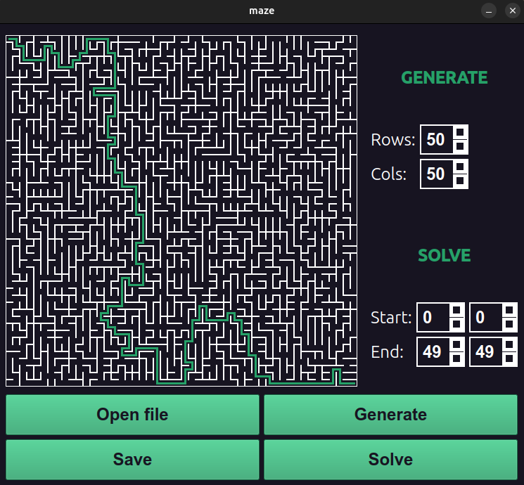
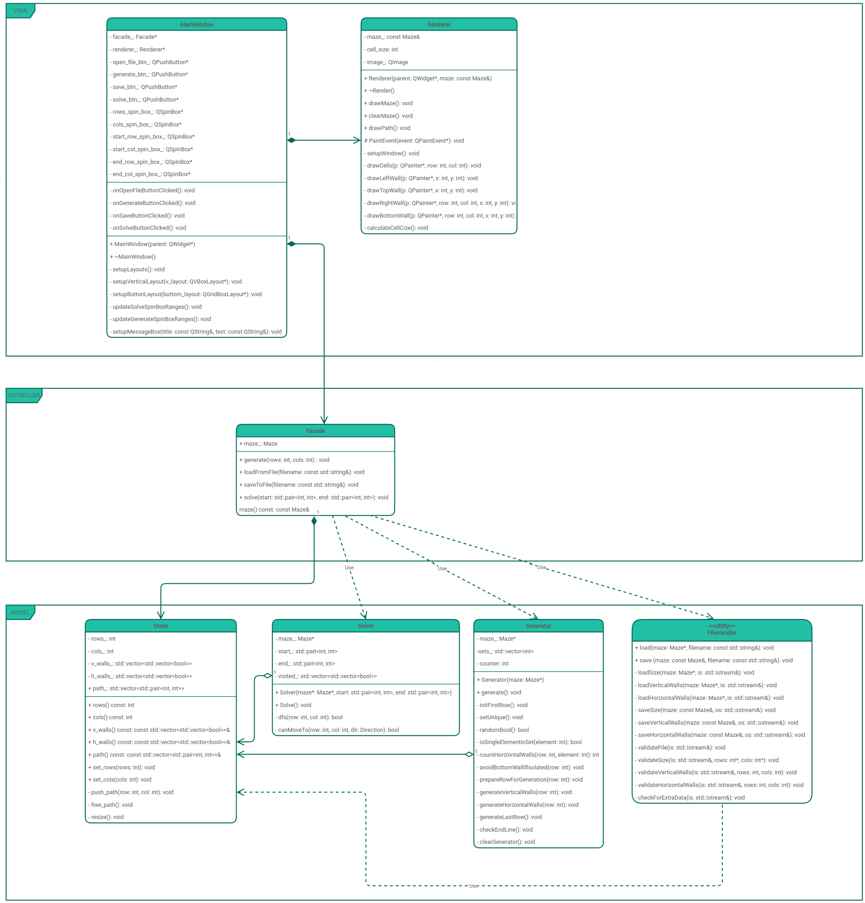

<a id="readme-top"></a>

 | [![Contributors][contributors-shield]][contributors-url] | [![Forks][forks-shield]][forks-url] | [![Stargazers][stars-shield]][stars-url] | [![Issues][issues-shield]][issues-url] | [![MIT License][license-shield]][license-url] |

<br />
<div align="center">
  
  <h3 align="center">Maze</h3>

  <p align="center">
    <br />
    <a href="https://github.com/emmonbear/A1_Maze_CPP"><strong>Explore the docs »</strong></a>
    <br />
    <br />
    <a href="https://github.com/emmonbear/A1_Maze_CPP">View Demo</a>
    /
    <a href="https://github.com/emmonbear/A1_Maze_CPP/issues/new?labels=bug&template=bug-report---.md">Report Bug</a>
    /
    <a href="https://github.com/emmonbear/A1_Maze_CPP/issues/new?labels=enhancement&template=feature-request---.md">Request Feature</a>
  </p>
</div>


<details>
  <summary><strong>Table of Contents</strong></summary>
  <ol>
    <li>
      <a href="#about-the-project">About The Project</a>
      <ul>
        <li><a href="#uml-class-diagram">UML class diagram</a></li>
        <li><a href="#built-with">Built With</a></li>
      </ul>
    </li>
    <li>
      <a href="#getting-started">Getting Started</a>
      <ul>
        <li><a href="#required-software">Required software</a></li>
        <li><a href="#installation">Installation</a></li>
      </ul>
    </li>
    <li><a href="#contributing">Contributing</a></li>
    <li><a href="#license">License</a></li>
    <li><a href="#contact">Contact</a></li>
  </ol>
</details>


## About The Project

 <br>

The goal of this project is to implement a program program that can generate and render 
perfect mazes.

- The program is developed in the `C++` standard language using the `gcc` compiler. 
Additional libraries and `Qt` modules are used;
- The program code is located in the `src` folder;
- The program and test build is configured using `CMake`, which is launched using 
`Makefile` with a standard set of targets for a GNU program: `all`, `install`, 
`uninstall`, `clean`, `dvi`, `dist`, `tests`, `gcov_report`. Installation is carried 
out in the `bin` folder in the repository root;
- The program is developed in accordance with the principles of object-oriented programming. 
The following development patterns are used: `Facade`, `MVC`;
- The code is written in accordance with `Google Style`;
- Modules related to loading and saving a maze to a file, generating an ideal maze, and solving 
a maze are covered with `unit` tests;;
- The program allows you to:
    - The maze can be stored in a file as a number of rows and columns, as well as two matrices 
    containing the positions of vertical and horizontal walls respectively. The first matrix shows 
    the wall to the right of each cell, and the second — the wall at the bottom. <br>
    An example of such a file:<br>
      ``` txt
      4 4
      0 0 0 1
      1 0 1 1
      0 1 0 1
      0 0 0 1

      1 0 1 0
      0 0 1 0
      1 1 0 1
      1 1 1 1   
      ```
    - The perfect maze is generated according to Eller's algorithm
    - Maximum size of the maze is 50x50
    - The solution of the Perfect Maze is generated according to the DFS (deep first search) algorithm
- The program has a graphical user interface based on the GUI libraries `Qt` with `API` for `C++`.
- The graphical user interface contains:
    - A button to load a maze from a file;
    - A button to generate a perfect maze;
    - A button to solve the perfect maze;
    - A button to save the maze to a file;
    - Spinbox for specifying the number of rows;
    - Spinbox for specifying the number of cols;
    - Spinboxes for specifying start and end coordinates;
- Implementation class inside the `s21` namespace;

### UML class diagram

 <br>


<p align="right">(<a href="#readme-top">back to top</a>)</p>

### Built With

<p align="center">
  <p>
    <a href="https://www.cplusplus.com/">
      
    </a>
    <a href="https://cmake.org/">
      
    </a>
    <a href="https://www.qt.io/">
      
    </a>
  </p>
</p>

<p align="right">(<a href="#readme-top">back to top</a>)</p>


## Getting Started

To get a local copy and run it, follow these steps.

### Required software

* CMake
  ```
  sudo apt install cmake
  ```

* Qt
  ```
  sudo apt install qt6-base-dev
  ```

### Installation

1. Install the required software (if missing)
2. Clone the repository
    ```sh
    git clone git@github.com:emmonbear/A1_Maze_CPP.git
    ```
3. Run the installation program
    ```sh
    make install
    ```
4. Run the program manually (`A1_Maze_CPP/bin/maze`) or enter the command
    ```
    make run
    ```

<p align="right">(<a href="#readme-top">back to top</a>)</p>


## Contributing:

<a href="https://github.com/emmonbear/A1_Maze_CPP/graphs/contributors">
  
</a>


<p align="right">(<a href="#readme-top">back to top</a>)</p>


## License

Distributed under the MIT License. See `LICENSE.txt` for more information.

<p align="right">(<a href="#readme-top">back to top</a>)</p>


## Contact

Ilya Moskalev  - [Telegram](https://t.me/emmonbea) / [e-mail](moskaleviluak@icloud.com)

<p align="right">(<a href="#readme-top">back to top</a>)</p>


<!-- ССЫЛКИ И ИЗОБРАЖЕНИЯ MARKDOWN -->
[contributors-shield]: https://img.shields.io/github/contributors/emmonbear/A1_Maze_CPP.svg?style=for-the-badge
[contributors-url]: https://github.com/emmonbear/A1_Maze_CPP/graphs/contributors
[forks-shield]: https://img.shields.io/github/forks/emmonbear/A1_Maze_CPP.svg?style=for-the-badge
[forks-url]: https://github.com/emmonbear/A1_Maze_CPP/network/members
[stars-shield]: https://img.shields.io/github/stars/emmonbear/A1_Maze_CPP.svg?style=for-the-badge
[stars-url]: https://github.com/emmonbear/A1_Maze_CPP/stargazers
[issues-shield]: https://img.shields.io/github/issues/emmonbear/A1_Maze_CPP.svg?style=for-the-badge
[issues-url]: https://github.com/emmonbear/A1_Maze_CPP/issues
[license-shield]: https://img.shields.io/github/license/emmonbear/A1_Maze_CPP.svg?style=for-the-badge
[license-url]: https://github.com/emmonbear/A1_Maze_CPP/blob/master/LICENSE.txt

